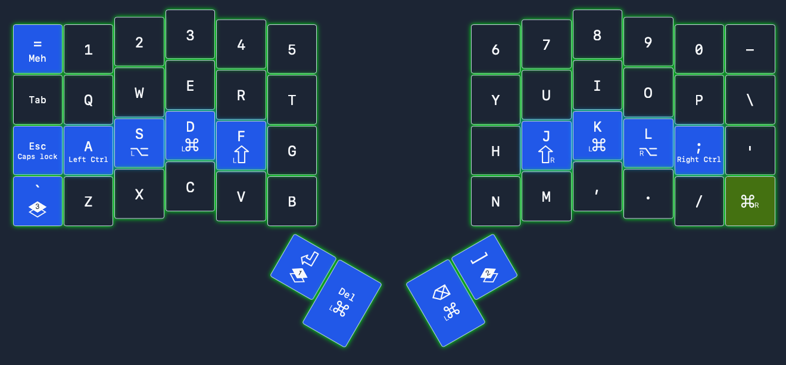
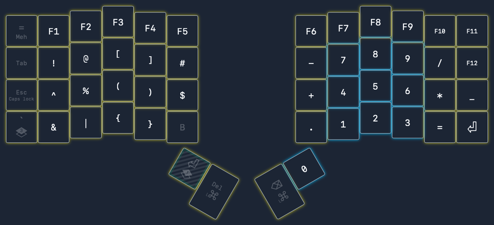
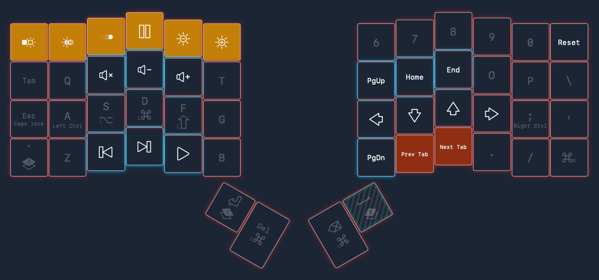

# Oryx ZSA

This is my ZSA Voyager layout configured with the Oryx software. Check out the
[Oryx ZSA](https://www.zsa.io/oryx) for more information.

## Graphical layout

### Layer 1

### Layer 2

### Layer 3

